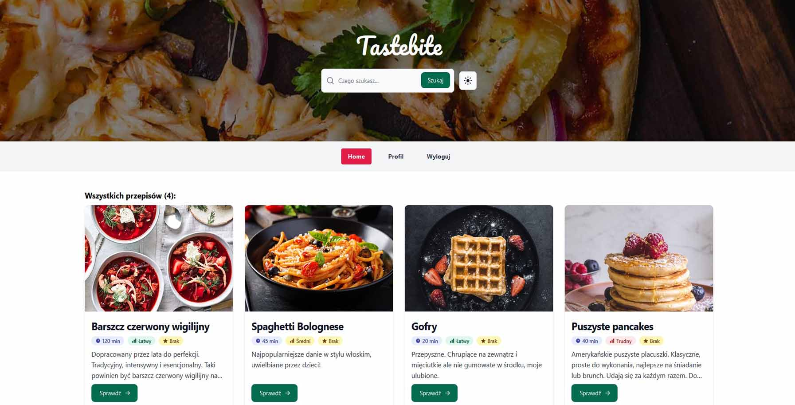

# Tastebite Recipes App


Application with the ability to add and manage recipes.

https://tastebite-app-sd.vercel.app/

## Main technologies


## Stack
- [Firebase](https://firebase.google.com) - backend by Google, app development platform that helps you build and grow apps
- [Flowbite](https://flowbite.com) - an open-source library of UI components based on the utility-first Tailwind CSS framework featuring dark mode support, a Figma design system, and more
- [Formik](https://formik.org) - the world's most popular open source form library for React and React Native
- [React Router](https://reactrouter.com/en/main) - a standard library for routing in React
- [Yup](https://github.com/jquense/yup) - a schema builder for runtime value parsing and validation

## Details
- created with the React framework
- CRUD - the ability to create and edit accounts and add and edit new properties
- data stored on Firebase Cloud Firestore database
- auth by Firebase Authentication
- context and reducer used to manage context values
- suspense for data fetching with lazy loading
- saving data in local storage using custom hook
- routing with React Router
- form validation and sanitization
- forms created with the Formik library
- layout and styling with Tailwind CSS
- responsive website design
- light/dark mode prefer system color scheme

## Tutorial and project structure
Inside of project, you'll see the following folders and files:

```
PROJECT_ROOT
├── public              # static assets
└── src
    ├── assets          # images and files
    ├── components      # React components
    ├── context         # React context and reducer files
    ├── helpers         # helpful functions
    ├── hooks           # custom hooks
    ├── schemas         # yup schemas
    └── pages           # page files
```

Download the repository to your local machine and run to download all missing dependencies:

```
npm install
```

After that you can run this project using: 

```
npm start
```

To build your application use:

```
npm run build
```

**To manage the content on the app you need to create a new Firebase project. Check the official documentation: https://firebase.google.com/docs**

After creating your own firebase project, just create the `.env.local` file with the following data in the main folder and restart your application:
```
REACT_APP_FIREBASE_KEY = YOUR_FIREBASE_KEY
REACT_APP_AUTH_DOMAIN = YOUR_FIREBASE_AUTH_DOMAIN
REACT_APP_PROJECT_ID = YOUR_FIREBASE_PROJECT_ID
REACT_APP_STORAGE_BUCKET = YOUR_FIREBASE_STORAGE_BUCKET
REACT_APP_MESSAGING_SENDER_ID = YOUR_FIREBASE_MESSAGING_SENDER_ID
REACT_APP_APP_ID = YOUR_FIREBASE_APP_ID
```
